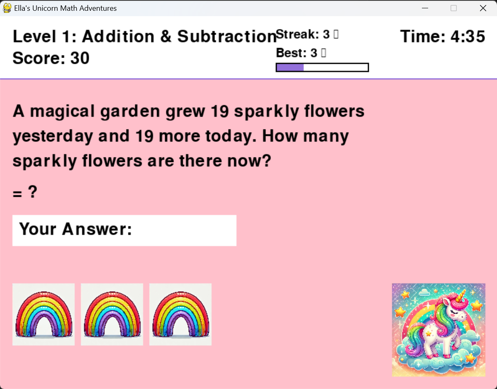

# 🦄 Unicorn Math Adventures

A magical math game that makes learning fun! Solve math problems with unicorns and rainbows while building math skills across multiple levels.



## ✨ Features

- 🎯 Three difficulty levels:
  - Level 1: Addition & Subtraction
  - Level 2: Multiplication & Division
  - Level 3: Fractions & Decimals
- 🌈 Engaging word problems with unicorn themes
- ⭐ Progress tracking with streaks and high scores
- 🎨 Beautiful unicorn and rainbow graphics
- 🎵 Sound effects for achievements
- 📊 High scores saved in Documents folder

## 🎮 How to Play

1. Choose your level from the main menu
2. Solve math problems to earn points and streaks
3. Get 10 correct answers in a row to level up
4. Collect rainbow rewards for correct answers
5. Try to beat your high score in 5 minutes!

### Controls
- Number keys: Enter answers
- Space & Forward slash: Enter fractions (e.g., "1 1/3")
- Enter: Submit answer
- Backspace: Correct mistakes

## 🚀 Getting Started

### Download and Play

1. Go to the [Releases](../../releases) page
2. Download the latest release
3. Extract and run "Unicorn Math Adventures.exe"

### Run from Source

1. Install Python 3.12 or later
2. Clone this repository:
   ```bash
   git clone https://github.com/yourusername/unicorn-math-adventures.git
   cd unicorn-math-adventures
   ```
3. Install dependencies:
   ```bash
   pip install -r src/requirements.txt
   ```
4. Run the game:
   ```bash
   python src/unicorn_math_adventures.py
   ```

## 🛠️ Development

### Project Structure
```
unicorn-math-adventures/
├── src/                    # Source code
│   ├── unicorn_math_adventures.py  # Main game
│   ├── requirements.txt    # Python dependencies
│   └── image_converter.py  # Asset conversion utility
├── assets/                 # Game assets
│   ├── images/            # Images
│   └── sounds/            # Sound effects
├── build.py               # Build script
└── README.md              # This file
```

### Building the Executable

1. Install dependencies:
   ```bash
   pip install -r src/requirements.txt
   ```
2. Run the build script:
   ```bash
   python build.py
   ```
3. Find the executable in the `dist` folder

## 🤝 Contributing

Contributions are welcome! Please feel free to submit a Pull Request.

## 📝 License

This project is licensed under the MIT License - see the [LICENSE](LICENSE) file for details.

## 🙏 Credits

Created with ❤️ using:
- [Python](https://www.python.org/)
- [Pygame](https://www.pygame.org/)
- [PyInstaller](https://www.pyinstaller.org/)
